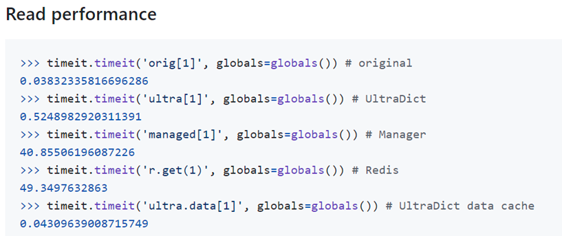
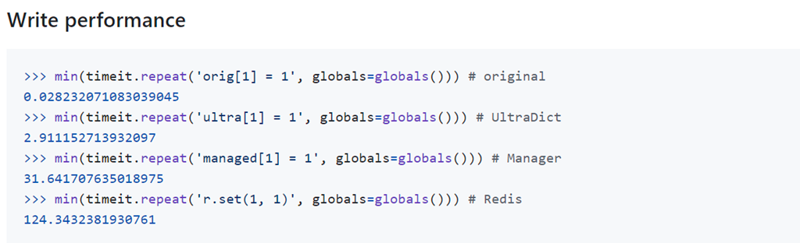
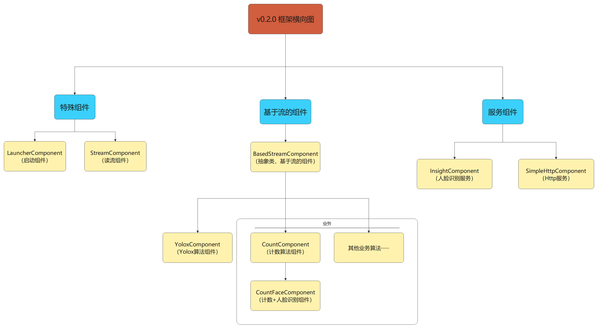
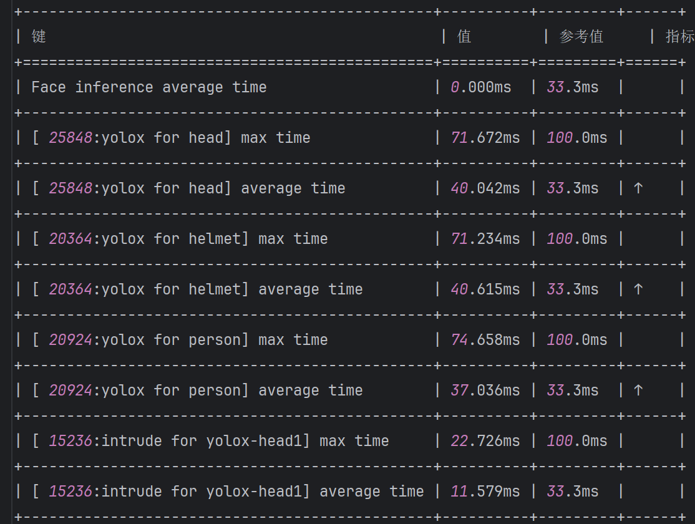
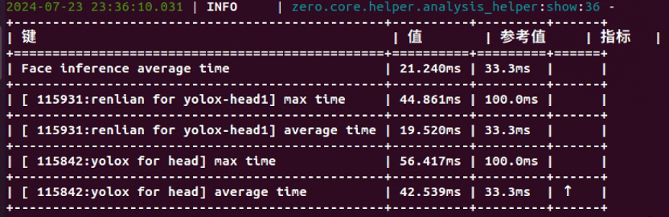
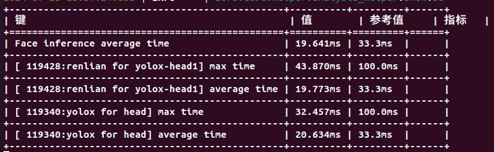

# ZeroAI v0.2.0

ZeroAI是一个由**配置文件驱动**的**组件式**，基于**视频流**的**多进程**AI框架，支持不同种类AI算法的快速部署与整合。

* 高效：

  * 基于Python多进程编写，相比于Socket通信，效率更高
  * 基于GPU的推理，可采用Tensor RT或ONNX-GPU加速

* 灵活性强：

  * 基于配置文件驱动，通过修改配置文件，可以实现算法的自由切换与高度自定义配置

  * 基于Port的设计，使得每阶段的输出结果可以复用

* 可扩展性强：

  * 基于组件式的设计，无需改动框架结构，可以轻松实现逻辑的横向、纵向扩展

* 易上手：

  * 框架预提供了丰富的组件，可以很轻松地根据需要接入自己的业务
  * 配备贴心的教程文档，助力开发人员快速上手

>Tips：
>
>* 所有资源和权重私聊本人获取，不公开
>* 如需下载旧版，请自行下载v0.1.0分支：`git clone -b v0.1.0 https://github.com/congtoudada/ZeroAI.git`

# v0.2.0 改进点

## 1.共享内存

使用UltraDict代替multiprocessing.Manager.dict作为共享内存容器，并根据需求进行更细粒度的划分，有效避免资源竞争，性能提升显著。

* Github：https://github.com/ronny-rentner/UltraDict/





## 2.整体架构

简化整个继承体系，利用组合代替继承，使得框架理解起来更加容易

* 新版代码不再有大量`Basexxx`和`Basedxxx`来限定输入输出，在整体上分为三大类：`特殊组件`、`基于流的算法组件`和`服务组件`。
  * 特殊组件是框架提供且固定的，开发者无需改动；
  * 基于流的算法组件就是取视频流，处理特定任务（如计数算法）；
  * 服务组件全局共享，等待请求并处理（如人脸识别）
* 对于帮助类组件不再强制要求继承`Component`，不必繁琐的命名为`xxxHelperComponent`，然后强行去重写生命周期
* 合并MOT到业务层，减少额外的进程开销
* 简化并解耦配置，现在视频流配置里不用再配算法，全部算法接入点统一到Application



## 3.流水线

所有模块根据帧速率引入休息延迟，不再无脑运行（使用update_fps配置）

* 假设视频流为30帧，目标检测耗时15帧，剩下的15帧不会一直轮询是否有新帧，而是使用time.sleep让出CPU执行权，供其他算法使用。合理的等待时间也能降低电力消耗，延长机器寿命
* 在每一阶段都有对应的共享内存维护，避免一块共享内存到处使用。同时读取方在发现新数据时会立刻copy，避免长时占用一份资源导致无法写入或上下文不一致。

## 4.可视化性能日志

v0.1.0最大的痛点就是卡顿无从下手，在v0.2.0中，为所有的计算模块都引入了可视化日志功能，会将所有模块的处理耗时打印，并对不合理的耗时以"↑"标出，提醒用户优化。



## 5.其他

* v0.1.0的文档过于严肃，教程示例过于繁琐，计划重写

* v0.1.0没有TensorRT相关内容，v0.2.0会补充，建议TensorRT能上就上，推理效率提升显著。在此奉上对比图：

Pytorch原生：



TensorRT加速：



# 文档目录


## 一、工程目录结构

```
.
├── bin                    # main脚本，启动入口
├── conf                   # 各种配置
│   ├── algorithm              # 算法配置
│   ├── cam                    # 视频流配置（一个视频流配置可对应多个算法）
│   ├── global                 # 全局配置
│   ├── application-dev.yaml   # 项目根配置（开发环境）
│   └── application-pro.yaml   # 项目根配置（生产环境）
├── lib                    # 各类算法
│   ├── business               # 业务类算法
│   ├── detection              # 目标检测算法
│   ├── face                   # 人脸识别算法
│   ├── mot                    # 多目标追踪算法
│   └── reid                   # 重识别算法
├── log                    # 日志（自动生成）
├── output                 # 框架输出
├── pretrained             # 预训练权重
├── res                    # 资源
│   ├── images                 # 图像资源
│   └── videos                 # 视频资源
├── script                 # 脚本工具
├── zero                   # ZeroAI框架
│   ├── core                   # 框架核心代码
│   └── utility                # 框架工具脚本
├── README.md              # 说明文档
├── setup.py               # 自定义包安装脚本
└── requirements.txt       # 项目依赖文件
```

## 二、安装

### 方式一：虚拟环境安装


```sh
# 创建虚拟环境并激活
conda create -n zeroai38 python=3.8 -y
conda activate zeroai38

# 安装Pytorch1.13.0 CUDA11.7
conda install pytorch==1.13.0 torchvision==0.14.0 torchaudio==0.13.0 pytorch-cuda=11.7 -c pytorch -c nvidia

# 安装requirement.txt和自定义包
git clone https://github.com/congtoudada/ZeroAI-Refactor.git
cd ZeroAI-Refactor
pip install -r requirements.txt
python installer.py

# 运行默认示例
python bin/main.py
```

> Tips：
>
> * conda镜像源参考：https://blog.csdn.net/weixin_43702653/article/details/125351698
> * pip镜像源参考：https://blog.csdn.net/chengyikang20/article/details/127455339

### 方式二：Docker安装（未实装）

安装VcXsrv：使得容器能够在Windows上显示图形（若不安装需手动关闭配置文件中可视化选项，通常在算法的root.yaml配置内，将`stream_draw_vis_enalbe`设为False）

* 教程：https://www.bilibili.com/read/cv15359444/?from=search（仅看`→配置VcXsrv`）

```sh
# 进入项目目录
cd ZeroAI-Refactor/
# 构建镜像
docker build -t zeroai:latest .

# 创建文件夹
mkdir pretrained
mkdir res
mkdir logs
mkdir output

# 运行容器(Windows)
docker run --name zero-ai --gpus all -it --rm `
-v ${PWD}/bin:/workspace/ZeroAI-Refactor/bin `
-v ${PWD}/modules:/workspace/ZeroAI-Refactor/modules `
-v ${PWD}/conf:/workspace/ZeroAI-Refactor/conf `
-v ${PWD}/deploy:/workspace/ZeroAI-Refactor/deploy `
-v ${PWD}/pretrained:/workspace/ZeroAI-Refactor/pretrained `
-v ${PWD}/res:/workspace/ZeroAI-Refactor/res `
-v ${PWD}/logs:/workspace/ZeroAI-Refactor/logs `
-v ${PWD}/output:/workspace/ZeroAI-Refactor/output `
-e DISPLAY=host.docker.internal:0 `
--device /dev/video0:/dev/video0:mwr `
--net=host --privileged zeroai:latest

# 运行默认示例(容器内运行)
python3 bin/main-dev.py
```

打包Tensor RT

```sh
docker run --gpus all -it --rm nvcr.io/nvidia/tensorrt:22.12-py3

sudo python modules/algorithm/bytetrack_module/bytetrack/trt.py -f conf/dev/detection/yolox/exps/yolox_s_person.py -c pretrained/detection/yolox/person/yolox_s.pth -expn person
```

> Tips：目前只测试了Windows上Docker的安装运行，Linux后期再测，二者可能在图形显示上略有差异

```sh
# 运行容器(Linux) Gitee版
docker run --name zero-ai --gpus all -it --rm \
-v $PWD/bin:/workspace/zero-ai-refactor/bin \
-v $PWD/modules:/workspace/zero-ai-refactor/modules \
-v $PWD/conf:/workspace/zero-ai-refactor/conf \
-v $PWD/deploy:/workspace/zero-ai-refactor/deploy \
-v $PWD/pretrained:/workspace/zero-ai-refactor/pretrained \
-v $PWD/res:/workspace/zero-ai-refactor/res \
-v $PWD/logs:/workspacezero-ai-refactor/logs \
-v $PWD/output:/workspace/zero-ai-refactor/output \
-e DISPLAY=host.docker.internal:0 \
--device /dev/video0:/dev/video0:mwr \
--net=host --privileged zeroai:latest

docker run --name zero-ai --gpus all -it --rm -v $PWD/bin:/workspace/zero-ai-refactor/bin -v $PWD/modules:/workspace/zero-ai-refactor/modules -v $PWD/conf:/workspace/zero-ai-refactor/conf -v $PWD/deploy:/workspace/zero-ai-refactor/deploy -v $PWD/pretrained:/workspace/zero-ai-refactor/pretrained -v $PWD/res:/workspace/zero-ai-refactor/res -v $PWD/logs:/workspacezero-ai-refactor/logs -v $PWD/output:/workspace/zero-ai-refactor/output -e DISPLAY=host.docker.internal:0 --device /dev/video0:/dev/video0:mwr --net=host --privileged zeroai:latest

# 运行容器(Linux) Github版
docker run --name zero-ai --gpus all -it --rm \
-v $PWD/bin:/workspace/ZeroAI-Refactor/bin \
-v $PWD/modules:/workspace/ZeroAI-Refactor/modules \
-v $PWD/conf:/workspace/ZeroAI-Refactor/conf \
-v $PWD/deploy:/workspace/ZeroAI-Refactor/deploy \
-v $PWD/pretrained:/workspace/ZeroAI-Refactor/pretrained \
-v $PWD/res:/workspace/ZeroAI-Refactor/res \
-v $PWD/logs:/workspace/ZeroAI-Refactor/logs \
-v $PWD/output:/workspace/ZeroAI-Refactor/output \
-e DISPLAY=host.docker.internal:0 \
--device /dev/video0:/dev/video0:mwr \
--net=host --privileged zeroai:latest
```

#### 可能出现的错误

> 1.docker: Error response from daemon: could not select device driver "" with capabilities: [[gpu]].

这个错误信息表明 Docker 尝试运行一个需要 GPU 支持的容器，但未能找到合适的设备驱动程序。导致这一问题的原因和解决方法可能包括以下几个方面：

**确保安装了 NVIDIA Docker**

如果你打算在 Docker 容器中使用 NVIDIA GPU，你需要安装 NVIDIA Docker。可以按照以下步骤进行：

- **安装 NVIDIA 驱动**: 确保你的主机上已经安装了适合你 GPU 的 NVIDIA 驱动。

- **安装 Docker**: 如果你还没有安装 Docker，可以使用以下命令安装：

  ```
  bash复制sudo apt-get update
  sudo apt-get install docker-ce docker-ce-cli containerd.io
  ```

- **安装 NVIDIA Container Toolkit**: 运行以下命令以安装 NVIDIA Container Toolkit：

  ```
  bash复制distribution=$(lsb_release -cs)
  curl -s -L https://nvidia.github.io/nvidia-docker/gpgkey | sudo apt-key add -
  curl -s -L https://nvidia.github.io/nvidia-docker/$distribution/nvidia-docker.list | sudo tee /etc/apt/sources.list.d/nvidia-docker.list
  sudo apt-get update
  sudo apt-get install -y nvidia-docker2
  ```

- **重启 Docker 服务**:

  ```
  bash复制sudo systemctl restart docker
  ```

## TODO

* 找工作（游戏开发）
* 拓展算法
* 接入Web后端
* Tensor RT、Cython加速
  * Cython参考：https://www.bilibili.com/video/BV1NF411i74S?p=1
